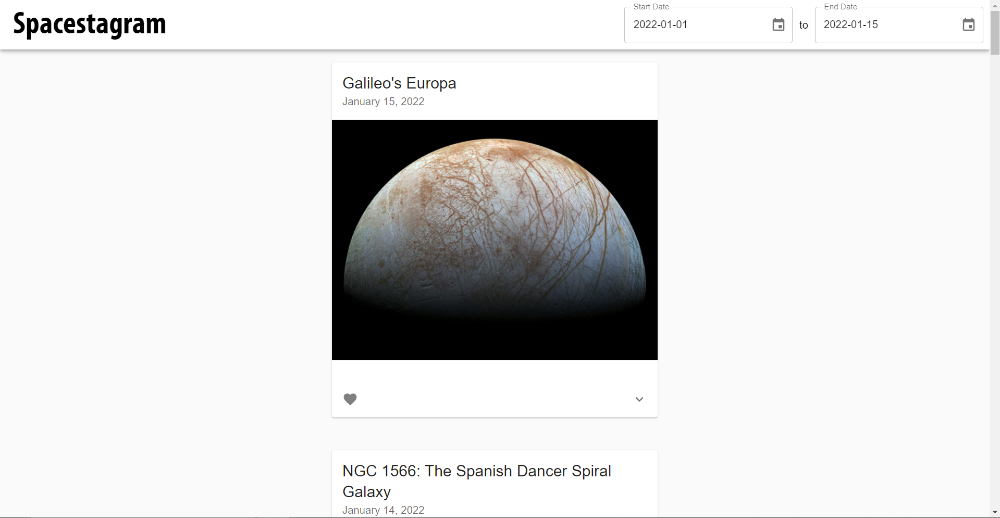

<!-- PROJECT LOGO -->
<br />
<p align="center">
  <a href="https://spaceig.netlify.app/">
    
  </a>
</p>

Demo: https://spaceig.netlify.app/

Web app that can search through NASA's Astronomy Picture of the Day (APOD) API, allowing users to endlessly scroll through photos and or browse photos between specific date range.

## Motivation

To showcase my Front-End development skills, via React, for the Shopify Web Developer Intern Challenge - Summer 2022.

## Features

- **Date Range Picker**: Search photos between two specific dates, inclusive.
- **Like Posts**: Like favorite photos, undo the "like" as well.
- **Dropdown Descriptions**: Click on the dropdown button to reveal a description about the photo.
- **Loading Bar**: Displays a loading state while waiting for NASA’s API to return data.
- **Load More Posts On Scroll**: Loads more APODs when users reach the end of the page.
- Accessible and Responsive User Interface.

## Accessibility

Based on the [MDN Reference](https://developer.mozilla.org/en-US/docs/Learn/Accessibility/HTML), the app is accessible by all kinds of users and full functionality can be attained via keyboard, mouse, and touch screen.

Keyboard Controls:

- `Tab ↹` to traverse through different interactive components of the app, `Tab ↹ + ⇧ Shift` to go backwards.
- `↵ Return` captures clicking functionality such as liking a photo, revealing photo description by clicking on dropdown button, and or opening calendar by clicking on date picker.
- `Up Arrow ↑`, `Down Arrow ↓`, `Right Arrow →`, and `Left Arrow ←` to scroll and select datas on the calendar effectively.
-

## Built With

- [React](https://reactjs.org/)
- [Material UI](https://mui.com/)

## Installation

```bash
# get the project
$ git clone https://github.com/shivamp08/spacestagram

# install dependencies
$ npm install

# run start (using react-scripts - default port: 3000)
$ npm start

```

## Screenshot


