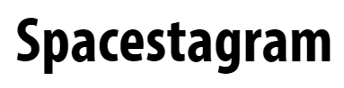
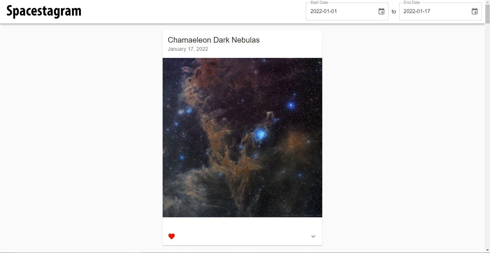

<!-- PROJECT LOGO -->
<br />
<p align="center">
  <a href="https://spaceig.netlify.app/">
    
  </a>
</p>

Demo: https://spaceig.netlify.app/

Web app that can search through NASA's Astronomy Picture of the Day (APOD) API, allowing the user to

## Motivation

To showcase my Front-End development skills, via React, for the Shopify Web Developer Intern Challenge - Summer 2022.

## Features

- **Responsive Design **: Search the OMDB database and display the results.
- **Nominate**: Add a movie from the search results to nomination list.
- **View Nominations**: View the list of films already nominated (5 max).
- **Remove Nomination**: Remove a nominee from the nomination list.
- **Save Nominations**: Saves nomination list when user leaves page.
- **Shareable Links**: Share nominations with other people by using a shareable link.
- Responsive User Interface.

## Built With

- [React](https://reactjs.org/)
- [Material UI](https://mui.com/)

## Installation

```bash
# get the project
$ git clone https://github.com/shivamp08/theshoppies

# install dependencies
$ npm install

# run start (using react-scripts - default port: 3000)
$ npm start

```

## Screenshot


